# My Business Product

**Driv hela verksamheten från en enda panel.**

En självhostad Laravel 13 + Filament 3.3-adminpanel för produktkataloger, lager i flera lager, fakturering med riktigt fungerande betalningslösningar, och marknadsförings-/marknadsplatskopplingar för Google, Meta, Amazon, eBay med flera. Ett köp, installera på din egen server, äg det för alltid — inget om din katalog, dina kunder eller API-nycklar går någonsin genom en tredjepartsserver.

**Version 1.32.4** · Adminpanel, nätbutik och dokumentation tillgängliga på 14 språk: engelska, ukrainska, norska, svenska, litauiska, tyska, spanska, portugisiska, brasiliansk portugisiska, franska, polska, italienska, turkiska, nederländska och indonesiska.

---

## Vad som ingår

| Modul | Vad den gör |
|---|---|
| **Katalog och varianter** | Produkter, varianter, kategorier, streckkoder, huvudbild + omorganiserbara galleribilder, valfria dokument (datablad, ritningar, specifikationer). Varje uppladdad bild konverteras automatiskt till WebP. Bulk-CSV-import/export, plus riktig produktimport från Shopify, WooCommerce, Amazon och eBay — en knapp, välj källa |
| **Streckkodsskanning** | Produktsökning hittar artiklar via skannad streckkod/SKU direkt; följesedels- och orderrader har en «Skanna streckkod»-knapp för USB-/Bluetooth-läsare |
| **Lager i flera lager** | Antal spåras per lager, inkommande/utgående/överföringsföljesedlar, varje rörelse loggas automatiskt |
| **Fakturor och betalningar** | Varumärkta fakturor med en tokenbaserad offentlig betalningssida och nedladdningsbar PDF — 8 aktiva betalningslösningar (Stripe, PayPal, LiqPay, Fondy, WayForPay, Vipps MobilePay, Paysera, Revolut), verifierade server-side via signerade webhooks |
| **Marknadsföring och marknadsplatser** | Live katalogsynkronisering till Google Shopping och Meta Catalog; annonsresultat från Google, Meta och TikTok Ads; anslutningar för Amazon, eBay, Rozetka, Shopify, WooCommerce, PrestaShop och Wix |
| **Inbyggd SEO** | Riktig meta description, Open Graph, Twitter Card och Schema.org JSON-LD-utdata på nätbutiken — inte bara inställningsfält. Live `/sitemap.xml` och `/robots.txt` |
| **AI-assistent** | Använd din egen Anthropic-, OpenAI- eller xAI-nyckel — «Generera med AI» för produktbeskrivningar/SEO-text, plus en valfri, tillståndslös AI-chattwidget på nätbutiken med en systemprompt du själv skriver |
| **E-post, SMS och Telegram** | Riktade kampanjer per prisgrupp, plus varningar om lågt lager som skickas till din egen Telegram-bot |
| **Rollbaserad säkerhet** | Tvåfaktorsinloggning (TOTP, lokalt genererad QR-kod och återställningskoder), sex inbyggda roller med behörigheter som gäller i varje modul, full aktivitetsinsyn |
| **Server & säkerhet-sida** | Miljöinformation, en live säkerhetschecklista, en localhost-only portkontroll, samt ettklicks felsökningsläges-växling + cache-rensning — ingen SSH eller artisan-åtkomst behövs |
| **Floodskydd** | Hastighetsbegränsning på varje offentlig rutt; stöd för `TRUSTED_PROXIES` så att det fortsätter fungera korrekt bakom Cloudflare eller en annan CDN/WAF |

En offentlig, kundvänd **nätbutik** medföljer också — separat från adminpanelen, med sökning, filter, kundvagn, kassa, ett produktbildgalleri och en valfri AI-chattwidget.

---

## Design och UX

**Adminpanel** — Byggd på Filament 3.3 med en anpassad färgpalett (blå `#5385C2` som primärfärg, plus semantiska färger för fara/framgång/varning/info) och typsnittet Inter. Animerad delad-skärm-inloggningssida, en live-instrumentpanel med ett 14-dagars intäktsdiagram och en checklista för verksamhetsstart, stöd för ljust/mörkt tema, och rollbaserad navigering — var och en av de sex inbyggda rollerna ser bara de moduler den faktiskt har behörighet till, inte bara gråmarkerade, oanvändbara länkar.

**Publik nätbutik** — Standardtemats identitet är ett «fraktmanifest»-utseende — lager, fraktsedlar, lagernivåer — i stället för en generisk mallbutik: en varm pappersbakgrund, bläcksvart text och en rostfärgad stämpelaccent, kombinerat med Big Shoulders Display (rubriker), Work Sans (brödtext) och JetBrains Mono (priser, etiketter, data) via Bunny Fonts — inga Google Fonts, ingen spårning. Ett signaturhack i utstansad stil vid priset (ett hörnklipp med `clip-path`) återkommer på prisetiketter, statusstämplar och märket i header/footer, och binder samman varje sida. Ett andra, mer minimalistiskt tema medföljer för köpare som föredrar ett enklare utseende.

**Marknadsförings-landningssida** — En sammanhållen turkos/blå palett med samma Inter + JetBrains Mono-kombination, och ett «MANIFEST · MBP-0001»-stämpelmotiv som återspeglar nätbutikens egen identitet, så att marknadsföringssajten och produkten den säljer känns som en enda sak, inte två orelaterade mallar.

**Inget byggsteg, någonstans** — Varje skärm (adminpanel, nätbutik, marknadsföringssidor) levereras med CSS och JavaScript redan på plats. Det finns inget att kompilera, inget Node/npm-beroende och inget CDN-ramverk att vänta på — packa upp, så fungerar det.

---

## Skärmbilder

### Instrumentpanel
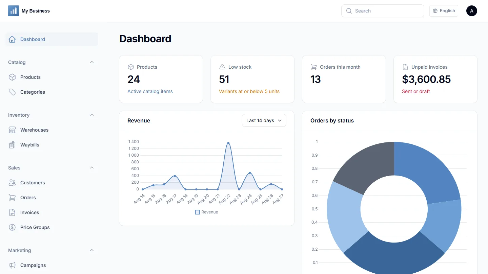

### Produkter
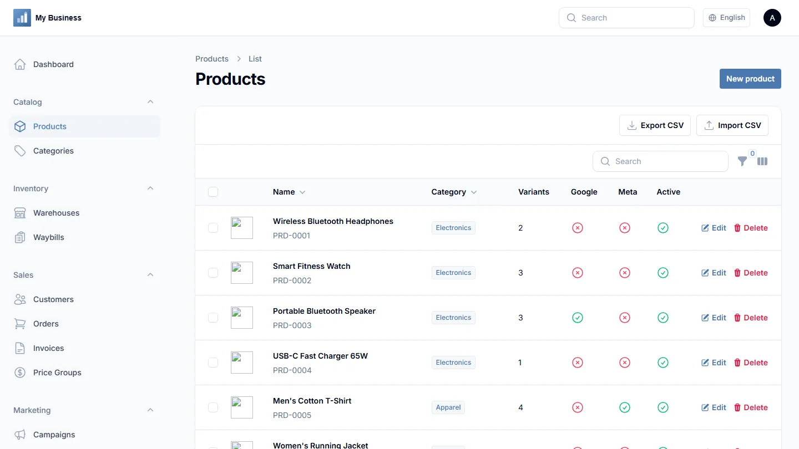

### Fakturor
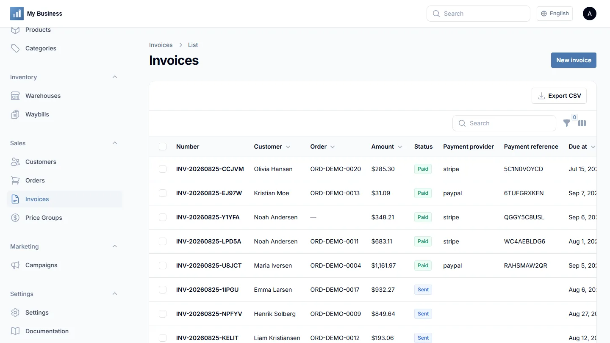

### Ordrar
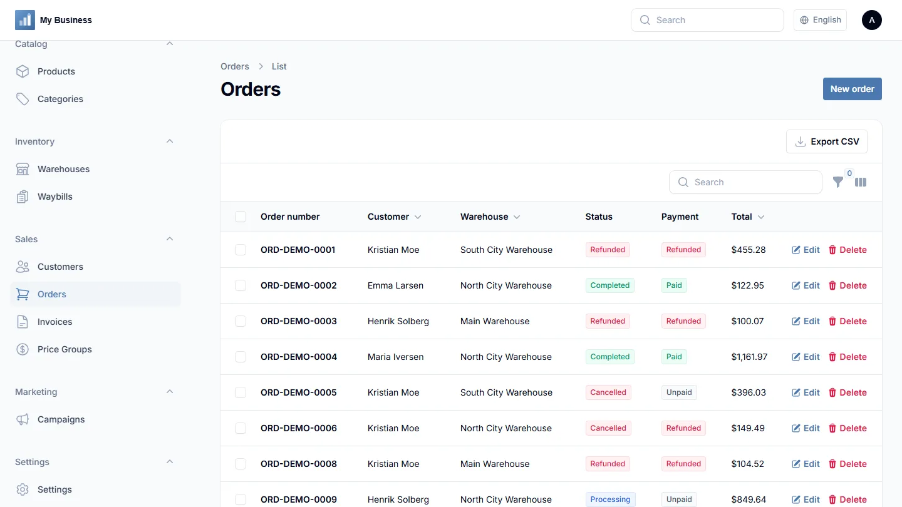

### Offentlig nätbutik
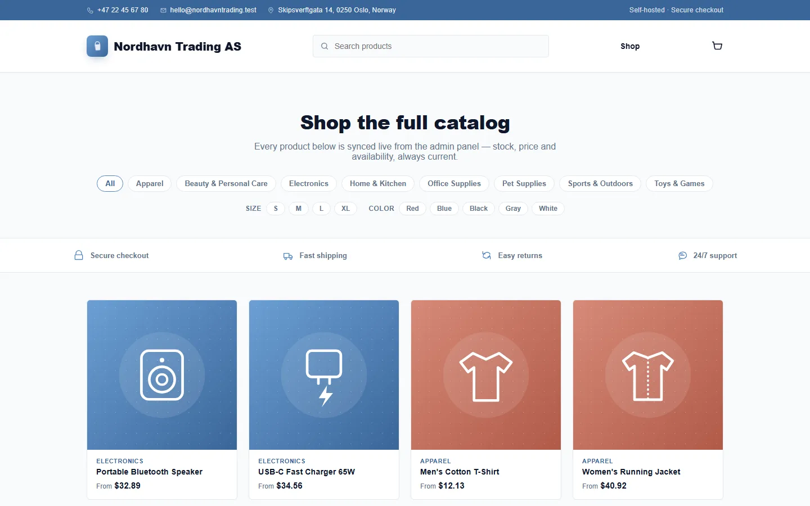

### Marknadsföring och annonser
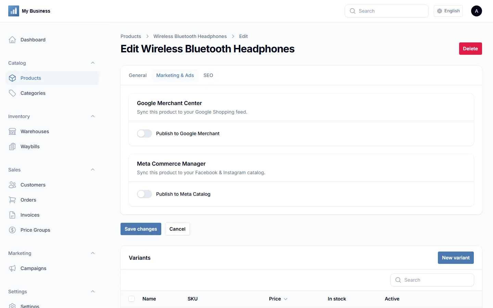

### Marknadsplatser
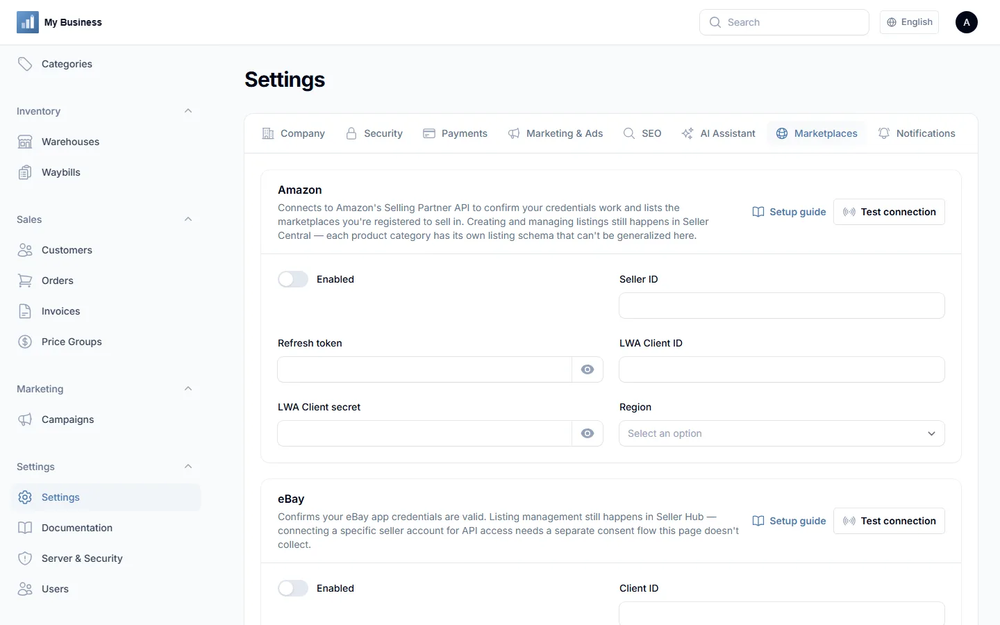

### Aviseringar
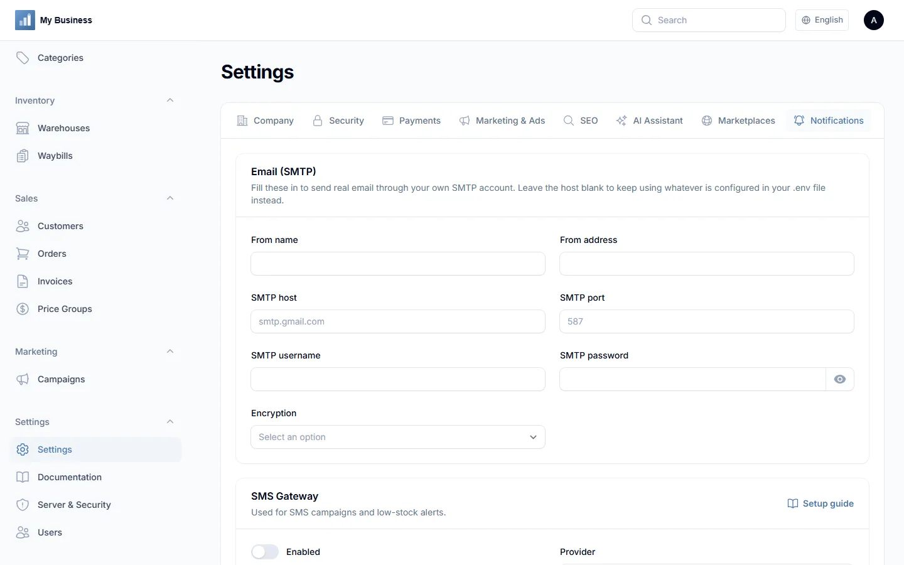

### Användare och roller
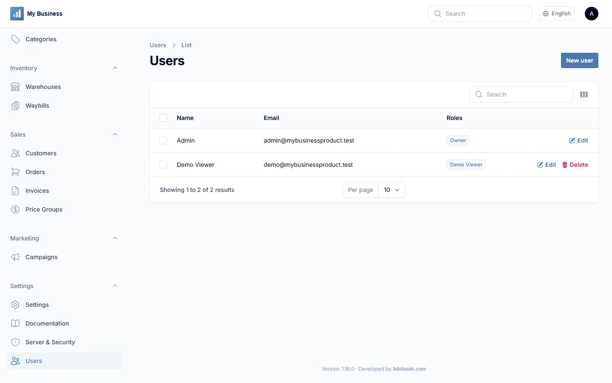

### Server & säkerhet
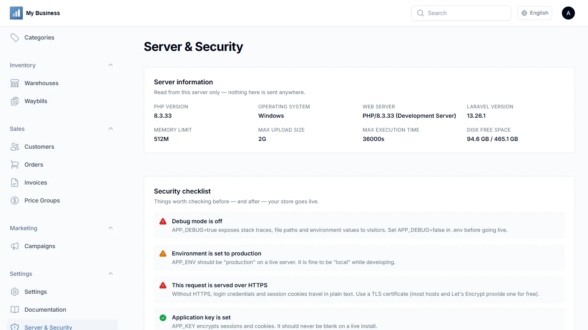

### Inloggning
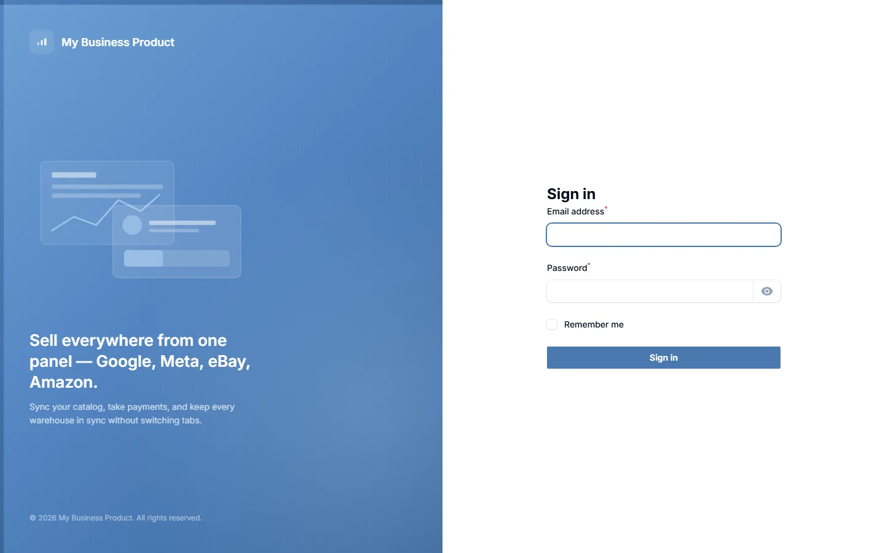

---

## Teknik

- **Laravel** 13
- **Filament** 3.3 (adminpanel)
- **PHP** 8.3+
- **MySQL** 8+
- Vanlig Blade för nätbutiken — inget byggsteg krävs

## Installation

En webbaserad installationsguide (`/install`) hanterar kravkontroller, databasinställning, migreringar, en valfri exempeldata-seed, det första adminkontot och företagsuppgifter — på 14 språk, och fungerar oavsett om appen ligger i domänens rot eller i valfri underkatalog, på Apache, LiteSpeed eller nginx. Se `README.txt` och `public/documentation.html` för fullständiga installationsinstruktioner, eller kör det manuellt:

```bash
composer install --no-dev --optimize-autoloader
cp .env.example .env
php artisan key:generate
php artisan migrate --force
php artisan db:seed --class=DatabaseSeeder --force
php artisan storage:link
```

## Licens

Privat/kommersiell — se `LICENSE.txt`. Detta repository är inte en offentlig open source-distribution.
